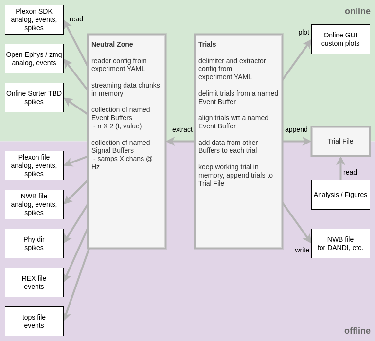

# Pyramid

Pyramid is tool for declarative neuro data synthesis, processing, and alignment into trials.

Pyramid reads data from various sources into a shared data model called the Neutral Zone, based two types:

 - lists of numeric events
 - regularly sampled signals

Data sources and trials are configured in a declarative style based on an experiment YAML file.
Based on configured event times it delimits time into trials and populates each trial with event and signal data from its own time range.
It produces a JSON or HDF5 "trial file" with a big array of all the trials.

Pyramid can run online as an experiment happens or offline for later data analysis.
Either way, it views data as a sliding window over time.
This approach is helpful for dealing with live data as well as large data files.

Here's an overview of the inciting vision!



## The Name "Pyramid"

"Pyramid" is a pun on "Python" and "FIRA", where FIRA is a set of long-standing Matlab analysis tools used by the [Gold Lab]*https://github.com/TheGoldLab/Lab_Matlab_Utilities).
Pyramid is intended as a successor to FIRA.

# Installation

Pyramid is pure Python, so it should be straightforward to install using coda and pip.

## conda

Pyramid's Python dependencies are captured in the [environment.yml](./environment.yml) in this repo.
You can use this `pyramid` environment directly, or set up your own environment that satisfies the same dependencies.

If you don't have conda yet, you can use these instructions to [install miniconda](https://docs.conda.io/projects/conda/en/latest/user-guide/install/index.html).

With that you can obtain this repo and set up the `pyramid` environment.

```
git clone https://github.com/benjamin-heasly/pyramid.git
cd pyramid
conda env create -f environment.yml
```

If you've already done that in the past but you want to make sure you're up to date, you can update your local environment.

```
cd pyramid
git pull
conda env update -f environment.yml --prune
```

## pip

Now you can install Pyramid from this repo into the `pyramid` environment on your machine.

```
conda activate pyramid
pip install .
pyramid --help
```

If you've already done that in the past but you want to make sure you're up to date, you can reinstall pyramid.

```
git pull
pip install .
pyramid --help
```

## dev tools

During development I'm also using [hatch](https://github.com/pypa/hatch) and [pytest](https://docs.pytest.org/en/7.1.x/getting-started.html)  to manage Pyramid as a Python project.  Most users won't need to use these.

I'm manually installing these into the `pyramid` environment on my machine.

```
conda activate pyramid
pipx install hatch
pip install pytest
```

I'm running the Pyramid unit and integration tests like this:

```
hatch run test:cov
```

Hatch is smart enough to install pytest automatically in the tests environment it creates.
The reason I also install pytest manually is so that my IDE recognizes pytest for syntax highlighting, etc.

# Demos 

Please see some demos, each with its own README, in the [docs](docs/) folder:
