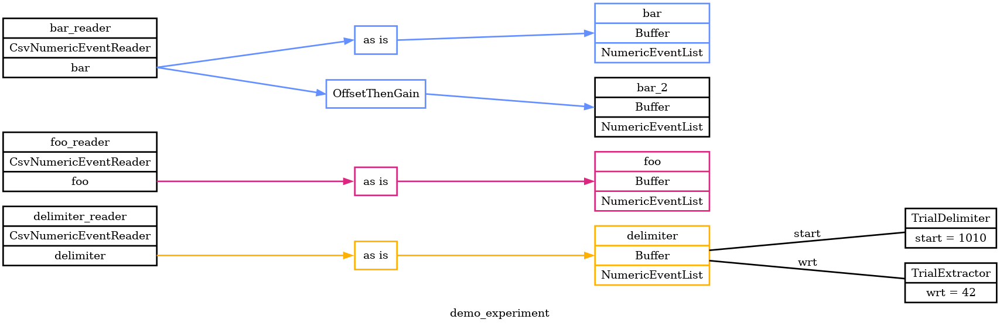

# Core Demo

Here's a demo / example of Pyramid's core functionality.

## overview

This example will read event data from several CSV files.
Some of the events will be used to delimit trials in time and to align data within a trial.
Other events will be selected based on delimited times, aligned, and assigned to appropriate trials.
Pyramid will write each trial to a JSON "trial file", as it goes along.

## visualizing experiment configuration

Let's start by running Pyramid to generate an overview of this demo experiment.
After that we'll go back and look at each part in more detail.

Try running the following:

```
cd pyramid/docs/core-demo

pyramid graph --graph-file demo_experiment.png --experiment demo_experiment.yaml --readers delimiter_reader.csv_file=delimiter.csv foo_reader.csv_file=foo.csv bar_reader.csv_file=bar.csv
```

This will produce a graph of Pyramid data sources and other configuration.
Having a graph is useful for demos like this!  Hopefully it's useful in general to have a way to check whether Pyramid interpreted your experiment YAML the way you expected.

`demo_experiment.png`


From this graph, we can see that Pyramid intends to:

 - read event data from 3 different CSV files
 - deal events as they arrive into 4 different named buffers
 - transform event values on the way into one of those buffers, but leave the other three "as is"
 - delimit trials based on events in the buffer named "delimiter"
 - align data within each trial based on other events in the same "delimiter" buffer
 - add additional data to trials from buffers named "foo", "bar", and "bar_2"


## configuration with YAML

The [demo_experiment.yaml](demo_experiment.yaml) we graphed above is an example of a Pyramid experiment [YAML](https://en.wikipedia.org/wiki/YAML) file.
Each experiment design or rig setup would have its own YAML file to capture and declare how the experiment is set up and how to interpret and transform data from various sources.

The main sections of each YAML file are:

 - `experiment` -- basic description of the experiment design and lab, suitable for including in an NWB file.
 - `readers` -- full description of data sources to read from and how to map and transform data from those sources into named buffers
 - `trials` -- how to delimit trials in time, how to align data within each trial, and optionally how to enhance each trial with additional name-value pairs
 - `plotters` -- optionally, how to visualize trials as they arrive

## data sources

This demo experiment reads data from three CSV files.
CSV is a simple format, easy to get started with.
Going forward we expect to read data from other online and offline sources like Plexon, Open Ephys / ZMQ and Phy.

Since the CSVs in this demo are small, we can just look at them here and get a sense for what should happen when Pyramid runs.

### delimiter
[delimiter.csv](delimiter.csv) determines the structure of trials in time.

```
time,   value
1.0,    1010
1.5,    42
2.0,    1010
2.5,    42
2.6,    42
3.0,    1010
3.5,    42
```

Each row is interpreted as one event.  The first column has the event time stamp, the second column has a numeric event value.
The first header row is ignored.

For the demo experiment Pyramid will treat events with value `1010` as trial starts and ends.
It will treat events with value `42` as trial "with respect to" events that determine the zero-time to which other data within each trial get aligned.

Based on the `1010` delimiting events in this CSV, we'd expect the following trials:
 - trial 0 -- everything preceeding the first `1010` at time `1.0`
 - trial 1 -- a trial between `1010` events at times `1.0` and `2.0`
 - trial 2 -- a trial between `1010` events at times `2.0` and `3.0`
 - trial 3 -- a last trial, everything after the last `1010` at time `3.0`

Based on the `42` wrt events, each trial other than trial 0 would have its data aligned to a zero-time half way through the trial.

### foo
[foo.csv](foo.csv) is an example of additional data to be added to each trial after it's delimited, as above.  In the CSV these `foo` events have absolute times.

```
time,   value
0.2,    0
1.2,    0
1.3,    1
2.2,    0
2.3,    1
```

Some `foo` events will arrive during trials 0, 1, and 2, but not during trial 3.  Within each trial, these same events will have their times realigned to the trial's `42` wrt event.  Some of the aligned timestamps will work out to be negative because they will arrive before the wrt event.


### bar
[bar.csv](bar.csv) is another example of data to be added to each trial after it's delimited.

```
time,   value
0.1,    1
3.1,    0
```

Some `bar` events will arrive during trials 0 and 3, but not during 1 or 2.

This demo experiment will use data it reads from `bar.csv` twice:

 1. direct use: copy events as-is into a buffer named `bar`.
 1. transformed use: copy events, apply a gain and offset to their values, and deal into in a separate buffer named `bar_2`

This demonstrates a way in which Pyramid can be flexible, allowing one level of indirection between raw source data and data assigned to trials.

## running a conversion

Let's put together the experiment configuration and input data and let Pyramid turn them into a trial file.

```
pyramid convert --trial-file demo_trials.json --experiment demo_experiment.yaml --readers delimiter_reader.csv_file=delimiter.csv foo_reader.csv_file=foo.csv bar_reader.csv_file=bar.csv
```

This is similar to the first command above, which produced an overview graph.  Instead of `graph` mode, this command uses `convert` mode to run through the data and produce a trial file named `demo_trials.json`.

Note that these commands include the CSV filenames that each CSV reader should use.  We could put the same file names directly into the `demo_experiment.yaml` file, and that would work fine.
But maybe the specifc files to read need to change each experiment session.  Instead of having to edit the YAML each time, we can override specific reader args from the command line.

### trial file

Let's look at the trial file we just made, `demo_trials.json`, to see if it matches our initial expectations.

For this demo the trial file is not very long, and we can include the JSON text here (mildly formatted here for clarity):

```
{"start_time": 0.0, "end_time": 1.0, "wrt_time": 0.0, "numeric_events": {"foo": [[0.2, 0.0]], "bar": [[0.1, 1.0]], "bar_2": [[0.1, -22.0]]}}
{"start_time": 1.0, "end_time": 2.0, "wrt_time": 1.5, "numeric_events": {"foo": [[-0.3, 0.0], [-0.2, 1.0]], "bar": [], "bar_2": []}}
{"start_time": 2.0, "end_time": 3.0, "wrt_time": 2.5, "numeric_events": {"foo": [[-0.3, 0.0], [-0.2, 1.0]], "bar": [], "bar_2": []}}
{"start_time": 3.0, "end_time": null, "wrt_time": 3.5, "numeric_events": {"foo": [], "bar": [[-0.4, 0.0]], "bar_2": [[-0.4, -20.0]]}}
```

Pyramid wrote each trial delimited during the `convert` run to one line in the trial file.  This follows the [JSON Lines](https://jsonlines.org/) convention where each line of the file is a valid JSON object.

We got 4 trials as expected, delimited by start and end times that fall on whole-numbered seconds.
Trials 1-3 have wrt times that falls between the start and end.
Data from the `foo`, `bar`, and `bar_2` buffers are assigned to each trial based on start and end times, then aligned to the wrt time.

## running with plotters

Pyramid `convert` is intended for offline, batch processing, when when we want things to run as fast as the data will allow.

Pyramid also has a `gui` mode which is intended for online or interactive processing.  In `gui` mode Pyramid produces the same trial file as `convert` mode, and also brings up figure windows with plots that update for each trial.

```
pyramid gui --trial-file demo_trials.json --experiment demo_experiment.yaml --readers delimiter_reader.csv_file=delimiter.csv foo_reader.csv_file=foo.csv bar_reader.csv_file=bar.csv
```

This command is identical to the `convert` command above, except for the mode argument, which is now `gui`.

A figure window should open and update every second as new trials arrive.
Custom plots can also be created in Pyton code and called for from the `plotters` section of the experiment YAML.

### simulating delay

Why does `gui` mode run for several seconds, when the data are just sitting there in CSV files?
This happens because Pyramid is simulating the delay between the trial `1010` start event times written in `delimiter.csv`.
Delay simulation is handy for demo purposes, and optional, and only happens if a reader's YAML contains `simulate_delay: True`.

## JSON trial file in Matlab

It should be possible to read a JSON trial file in a variety of environments, not just Pyramid or Python.
Pyramid includes [a bit of Matlab code](https://github.com/benjamin-heasly/pyramid/tree/main/matlab) for reading trials as a Matlab struct array.

If you add `pyramid/matlab` and its subfolders to your Matlab path, then you should be able to read a trial file like this:


```
trialFile = TrialFile('demo_trials.json');
trials = trialFile.read()

% trials =

%   1×4 struct array with fields:

%     start_time
%     end_time
%     wrt_time
%     numeric_events
%     signals
%     enhancements
%     enhancement_categories

events = [trials.numeric_events]

% events =

%   1×4 struct array with fields:

%     foo
%     bar
%     bar_2
```

The example above loads all the lines/trials into memory at once.
For larger trial files this might be unreasonable and it might be necessary to load fewer trials at a time.
The Pyramid Matlab utility supports an optional trial filter function to limit loaded trials by, for example, `start_time`.

```
trials = trialFile.read( @(trial) trial.start_time < 3 )

trials =

  1×3 struct array with fields:

    start_time
    end_time
    wrt_time
    numeric_events
    signals
    enhancements
    enhancement_categories
```


## HDF5 trial file

Pyramid can also produce trial files using HDF5.
This is a binary format that supports folder-like Groups, array-like Datasets, and data compression.
It's likely to be faster and smaller than JSON, though potentially less portable and not human-readable.

To create an HDF5 trial file, use the `.hdf5` extension for the `--trial-file` argument.

```
pyramid convert --trial-file demo_trials.hdf5 --experiment demo_experiment.yaml --readers delimiter_reader.csv_file=delimiter.csv foo_reader.csv_file=foo.csv bar_reader.csv_file=bar.csv
```

Matlab supports reading HDF5 files, and so does the Pyramid Matlab utility.
This works just like the JSON example above, but with the `.hdf5` file extension.

```
trialFile = TrialFile('demo_trials.hdf5');
trials = trialFile.read()

% trials =

%   1×4 struct array with fields:

%     start_time
%     end_time
%     wrt_time
%     numeric_events
%     signals
%     enhancements
%     enhancement_categories

events = [trials.numeric_events]

% events =

%   1×4 struct array with fields:

%     bar
%     bar_2
%     foo

trials = trialFile.read(@(trial) trial.start_time < 3)

% trials =

%   1×3 struct array with fields:

%     start_time
%     end_time
%     wrt_time
%     numeric_events
%     signals
%     enhancements
%     enhancement_categories
```
