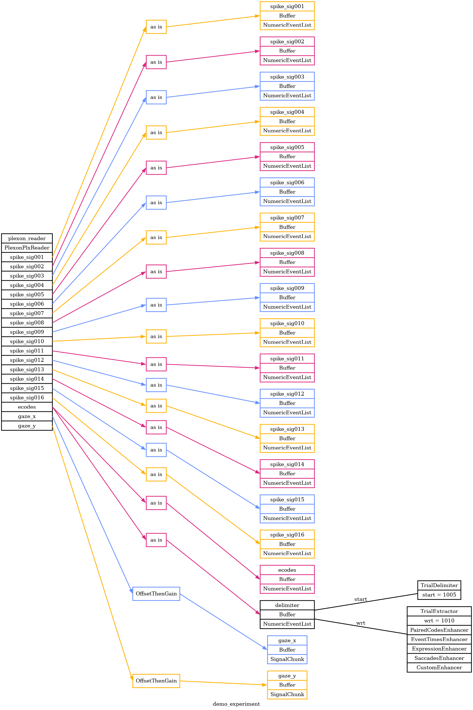
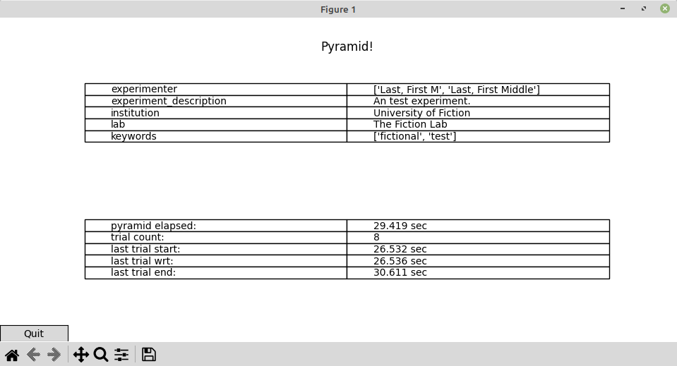
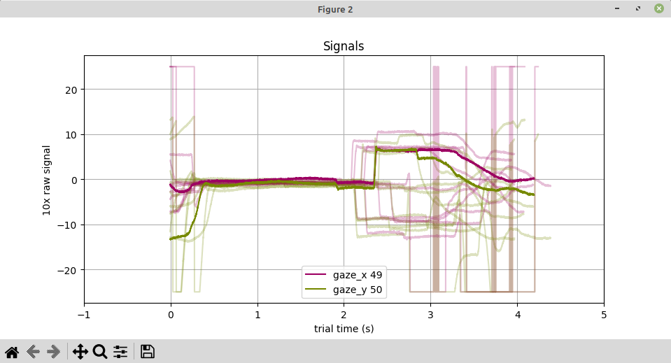
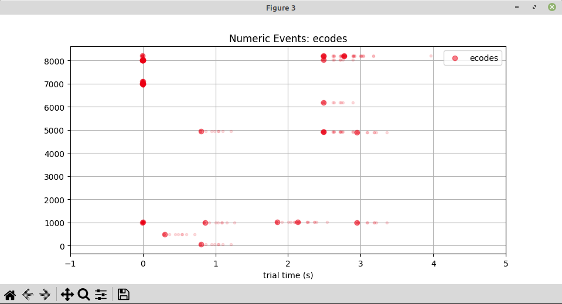
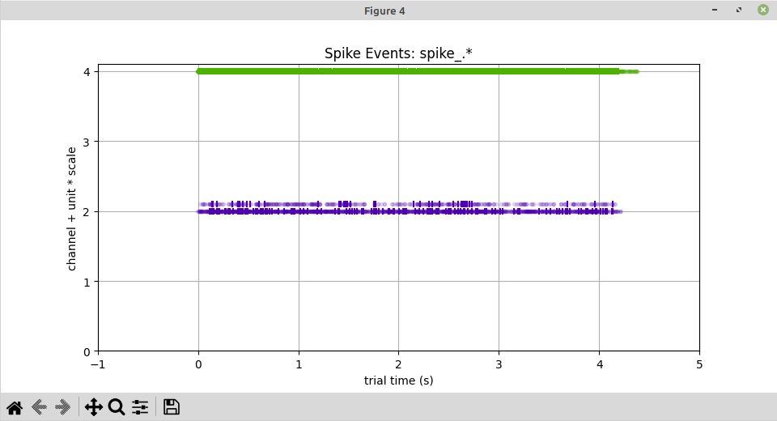
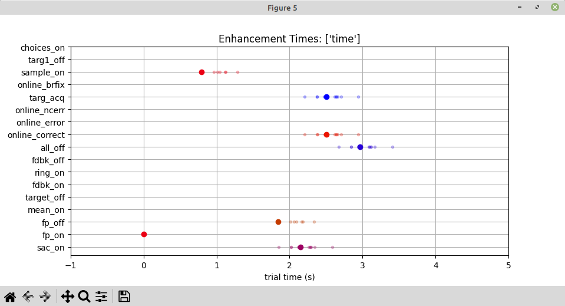
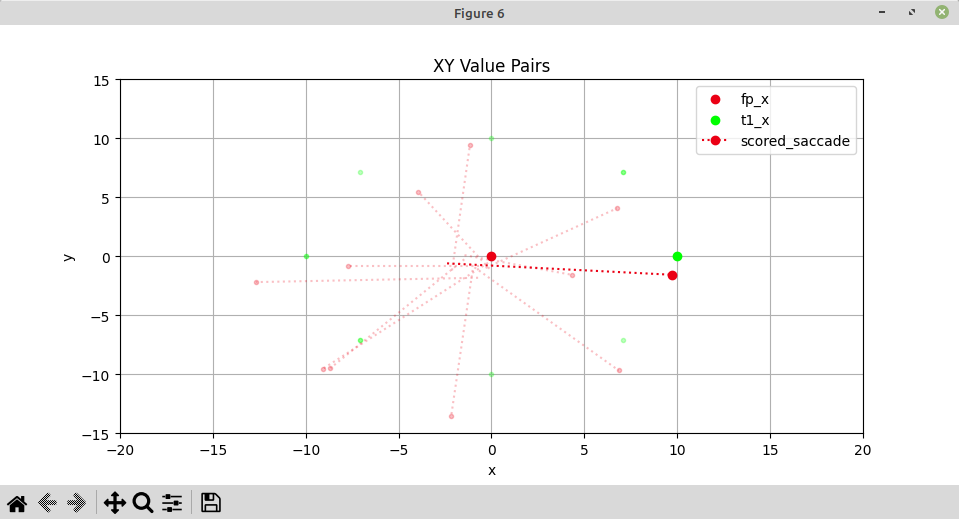

# Plexon Demo

Here's a demo / example of Pyramid with a Plexon `.plx` file.

## overview

This example will read from a Plexon `.plx` file on your machine.
Since `.plx` files can be large, you'll have to bring your own!
Note the path of the file you want to use, for example,

```
~/data/MrM/Raw/MM_2022_08_05_REC.plx
```

Pyramid will read several Plexon event, spike, and analog signal channels from the file.
It will use event data to delimit trials in time and assign events, spikes, and signals to each trial.
It will use standard, rule-based configuration as well as custom code to enhance each trial with additional name-value pairs.
Finally, it will use several standard plotters to visualize the trials as they come.

All of this is declared and configured in a Pyramid experiment YAML, [demo_experiment.yaml](demo_experiment.yaml).
This README will describe each section of the YAML along with links to relevant code and images. 

### experiment configuration graph

To start with, we can generate an overview graph of the experiment configuration.  Don't forget to `cd` to this folder!

```
cd pyramid/docs/plexon-demo

pyramid graph --graph-file images/demo_experiment.png --experiment demo_experiment.yaml --readers plexon_reader.plx_file=~/data/MrM/Raw/MM_2022_08_05_REC.plx --search-path ./config
```

`images/demo_experiment.png`


Note the `--search-path ./config` at the end of the command.
This lets Pyramid look in the nearby `./config` folder for files mentioned in `demo_experiment.yaml`, which helps us organize the demo.

The `--search-path` can point to any folder or list of folders on your machine, so it could help organize various shared and lab-specific code and config.
The default search path is in the user's home folder, `~/pyramd`.

## experiment YAML

The experiment YAML file [demo_experiment.yaml](demo_experiment.yaml) tells Pyramid how to read, process, and plot the data in our Plexon file.  Here's a look at each section.

### experiment: ###

The `experiment:` section is just metadata about the experiment itself suitable for inclusion in an NWB file, and displayed in Pyramids BasicInfoPlotter, below.

```
experiment:
  # Basic info suitable for inclusion in an NWB file.
  experimenter:
    - Last, First M
    - Last, First Middle
  experiment_description: An test experiment.
  institution: University of Fiction
  lab: The Fiction Lab
  keywords:
    - fictional
    - test
```

### readers: ###

The `readers:` section tells Pyramid to read a Plexon file, and which event, spike, and AD signal channels to take:

 - For `spikes` it will take `all` of the channels present in the file.
 - For `events` it will take only the `Strobed` channel and give it the name `ecodes`.  It will also make a separate copy the `ecodes` buffer, named `delimiter`.
 - For AD `signals` it will take only the channels named `X50` and `Y51` and give these the names `gaze_x` and `gaze_y`.  It will apply a gain of 10 to each signal to scale the voltage data into degrees visual angle.


```
readers:
  # How to get data, from where, and how to get it into buffers that trials can pick from.
  plexon_reader:
    class: pyramid.neutral_zone.readers.plexon.PlexonPlxReader
    args:
      # Override plx_file on cli with: --readers plexon_reader.plx_file=my_real_file.plx
      plx_file: my_file.plx
      spikes: "all"
      events:
        Strobed: ecodes
      signals:
        X50: gaze_x
        Y51: gaze_y
    # For gui demo, wait between trial delimiting events.
    simulate_delay: True
    extra_buffers:
      # Use ecodes as the delimiter for trials in time.
      delimiter:
        reader_result_name: ecodes
      # Scale up the gaze signals by a known gain.
      gaze_x:
        reader_result_name: gaze_x
        transformers:
          - class: pyramid.neutral_zone.transformers.standard_transformers.OffsetThenGain
            args:
              gain: 10
      gaze_y:
        reader_result_name: gaze_y
        transformers:
          - class: pyramid.neutral_zone.transformers.standard_transformers.OffsetThenGain
            args:
              gain: 10
```

### trials: ###

The `trials:` section tells Pyramid how to delimit trials in time based on raw event data, and how to build up each trial using rule-based configuration as well as custom code.

To delimit trials in time, Pyramid will look at the `delimiter` buffer.  Events with value `1005` will mark the boundary between trials, and events with value `1010` will mark the zero-time within each trial.

To build each trial Pyramid will use two standard, rule-based enhancers and two custom code enhancers.  All of the enchancers will add some name-value pairs to each trial, indicating things like events of interest, trial scores, saccades, etc.

 - A standard, rule-based [PairedCodesEnhancer](https://github.com/benjamin-heasly/pyramid/blob/main/src/pyramid/trials/standard_enhancers.py#L39) will look for numeric events that encode property-value pairs for each trial.  The names and encodings for these are declared in two tables, [config/main-ecode-rules.csv](config/main-ecode-rules.csv) and [config/special-ecode-rules.csv](config/special-ecode-rules.csv).
 - A standard, rule-based [EventTimesEnhancer](https://github.com/benjamin-heasly/pyramid/blob/main/src/pyramid/trials/standard_enhancers.py#L122) will look for named events of interest and record any occurrence times within each trial.  The names and encodings for these are declared in the same two tables, [config/main-ecode-rules.csv](config/main-ecode-rules.csv) and [config/special-ecode-rules.csv](config/special-ecode-rules.csv).
 - A standard [ExpressionEnhancer](https://github.com/benjamin-heasly/pyramid/blob/main/src/pyramid/trials/standard_enhancers.py#L189) will evaluate a given expression against each trial and add the result to each trial as 'actual_task', which will drive conditional enhancements below.
 - A custom [SaccadesEnhancer](hhttps://github.com/benjamin-heasly/pyramid/blob/main/docs/plexon-demo/custom_enhancers.py#L149) will examine the `gaze_x` and `gaze_y` AD signals for each trial and extract saccades.  Each saccade will be a dictionary of saccade parameters like `t_start`, `x_end`, `y_end`, etc.  The custom Python code for this is here in this folder, in [config/custom_enhancers.py](config/custom_enhancers.py).  This will only run for trials `when` the value of `actual_task` is true, and at least one `fp_off` time is present.
 - Another [CustomEnhancer](https://github.com/benjamin-heasly/pyramid/blob/main/docs/plexon-demo/custom_enhancers.py#L25) will examine all of the trial data and enchancements above and compute experiment-specific labels, scores, etc.  The Python code for this is in the same file, [config/custom_enhancers.py](config/custom_enhancers.py).  This will only run for trials `when` the value of `actual_task` is true.

```
trials:
  start_buffer: delimiter
  start_value: 1005
  wrt_buffer: delimiter
  wrt_value: 1010
  # Add named values to each trial, after event and signal data have been automatically added.
  enhancers:
      # Standard enchancers come along with the Pyramid code.
    - class: pyramid.trials.standard_enhancers.PairedCodesEnhancer
      args:
        buffer_name: ecodes
        rules_csv: [main-ecode-rules.csv, special-ecode-rules.csv]
      # Standard enchancers come along with the Pyramid code.
    - class: pyramid.trials.standard_enhancers.EventTimesEnhancer
      args:
        buffer_name: ecodes
        rules_csv: [main-ecode-rules.csv, special-ecode-rules.csv]
      # Standard enchancers come along with the Pyramid code.
    - class: pyramid.trials.standard_enhancers.ExpressionEnhancer
      args:
        expression: task_id > 0
        value_name: actual_task
      # Custom enchancers can be located in any specified "package path", eg the current folder.
    - class: custom_enhancers.SaccadesEnhancer
      package_path: .
      when: actual_task and len(fp_off) > 0
      # Custom enchancers can be located in any specified "package path", eg the current folder.
    - class: custom_enhancers.CustomEnhancer
      package_path: .
      when: actual_task
```

### plotters: ###

The plotters section declares several plotters that Pyramid will show in figure windows and update as each trial arrives.
Descriptions and shots below!

```
plotters:
    # Plot basic info about conversion process, plus a "Quit" button.
  - class: pyramid.plotters.standard_plotters.BasicInfoPlotter
    # Plot gaze signal data.
  - class: pyramid.plotters.standard_plotters.SignalChunksPlotter
    args:
      xmin: -1.0
      xmax: 5.0
      ylabel: 10x raw signal
    # Plot raw, numeric ecode data.
  - class: pyramid.plotters.standard_plotters.NumericEventsPlotter
    args:
      xmin: -1.0
      xmax: 5.0
      match_pattern: ecodes
    # Plot spike data with channels and units on the y-axis.
  - class: pyramid.plotters.standard_plotters.SpikeEventsPlotter
    args:
      xmin: -1.0
      xmax: 5.0
      match_pattern: spike_.*
      value_index: 1
      value_selection: 1
      marker: "|"
    # Plot time(s) of key events during each trial (enhancements in the "time" category).
  - class: pyramid.plotters.standard_plotters.EnhancementTimesPlotter
    args:
      xmin: -1.0
      xmax: 5.0
    # Plot XY value pairs from each trial (enhancements in the "value" category).
  - class: pyramid.plotters.standard_plotters.EnhancementXYPlotter
    args:
      xmin: -20
      xmax: 20
      ymin: -15
      ymax: 15
      # These XY pairs are plotted as separate points.
      xy_points:
        fp_x: fp_y
        t1_x: t1_y
        t2_x: t2_y
        sample_x: sample_y
      # These XY pairs are grouped together and plotted as lines.
      xy_groups:
        scored_saccade:
          x_start: y_start
          x_end: y_end
```
#### BasicInfoPlotter
The [BasicInfoPlotter](https://github.com/benjamin-heasly/pyramid/blob/main/src/pyramid/plotters/standard_plotters.py#L35) shows Pyramid's overall progress through the Plexon file along with static metadata about the experiment and subject.  It also has a `Quit` button -- _wow!_



#### SignalChunksPlotter
The [SignalChunksPlotter](https://github.com/benjamin-heasly/pyramid/blob/main/src/pyramid/plotters/standard_plotters.py#L188) shows gaze signal traces over time, aligned to the zero-time for each trial.  The most recent trial is in full color, on top of 10 recent trials which are partially transparent.



#### NumericEventsPlotter
The [NumericEventsPlotter](https://github.com/benjamin-heasly/pyramid/blob/main/src/pyramid/plotters/standard_plotters.py#L100) shows event times and raw numeric values for the `ecodes` buffer which came from the original Plexon `Strobed` channel.  The most recent trial is in full color, on top of 10 recent trials which are smaller and partially transparent.



#### SpikeEventsPlotter
The [SpikeEventsPlotter](https://github.com/benjamin-heasly/pyramid/blob/main/src/pyramid/plotters/standard_plotters.py#L486) shows spike event times from all Plexon spike channels, with trial number on the vertical axis.  Only spikes assigned to Plexon unit 1 are shown and the Plexon channels are color-coded in the legend.



#### EnhancementTimesPlotter
The [EnhancementTimesPlotter](https://github.com/benjamin-heasly/pyramid/blob/main/src/pyramid/plotters/standard_plotters.py#L278) shows the names and times for events of interest within each trial.  All trial enhancements that were placed into the `time` category are shown, including rule-based enhancements declared in [config/main-ecode-rules.csv](config/main-ecode-rules.csv) and [config/special-ecode-rules.csv](config/special-ecode-rules.csv) and custom enhancements created from [config/custom_enhancers.py](config/custom_enhancers.py).  The most recent trial is in full color, on top of 10 recent trials which are smaller and partially transparent.



#### EnhancementXYPlotter
The [EnhancementXYPlotter](https://github.com/benjamin-heasly/pyramid/blob/main/src/pyramid/plotters/standard_plotters.py#L367) shows 2D/XY values of interest from each trial.  Specific values to plot are declared by name:

 - `fp_x`/`fp_y`, `t1_x`/`t1_y`, and `t2_x`/`t2_y` are plotted as individual points
 - `scored_saccade` is plotted as a group of several points and shown as a line.  To show direction, the last point in the line gets a marker.

The most recent trial is in full color, on top of 10 recent trials which are smaller and partially transparent.




## running it

Here's how to run Pyramid in `gui` mode, which is how the plots shown above were created.

```
pyramid gui --trial-file demo_experiment.hdf5 --experiment demo_experiment.yaml --readers plexon_reader.plx_file=~/data/MrM/Raw/MM_2022_08_05_REC.plx --search-path ./config
```

This should open up a few figure windows, similar to the images above.
The plots should update every few seconds, as if replaying the original acquisition timeline (in `gui` mode Pyramid can simulate delay while reading from data files.)

To exit Pyramid, you can:
 - wait a long time for the replay to finish
 - close all the figure windows
 - `ctrl-c` or `kill` the Pyramid process
 - press the `Quit` button in the `BasicInfoPlotter`

If you're only interested in the trial file and not the gui, you can run Pyramid in `convert` mode.

```
pyramid convert --trial-file demo_experiment.hdf5 --experiment demo_experiment.yaml --readers plexon_reader.plx_file=~/data/MrM/Raw/MM_2022_08_05_REC.plx --search-path ./config
```

This won't plot anything, and will convert the Plexon file to a trial file as fast as it can.

### record and restore figure window positions

In case you get tired of rearranging plot figure windows, you can pass a `plot-positions` YAML file to Pyramid.

```
pyramid gui --trial-file demo_experiment.hdf5 --experiment demo_experiment.yaml --readers plexon_reader.plx_file=~/data/MrM/Raw/MM_2022_08_05_REC.plx --plot-positions plot_positions.yaml --search-path ./config
```

When a `plot-positions` YAML file is passed in, Pyramid will record and restore figure positions as follows:

 - On the first run, when the `plot-positions` YAML file doesn't exist yet, Pyramid will open figures in the default locations.
 - When exiting, Pyramid will record the current, user-arranged location of each figure window to the YAML file.
 - On subsequent runs, when the YAML file exists, restore each figure to its recorded location.

This seems to work pretty well and has been tested on a Linux machine and a macOS machine.
But this is only best-effort because matplotlib doesn't fully support arranging figure windows (as of writing in August 2023).
