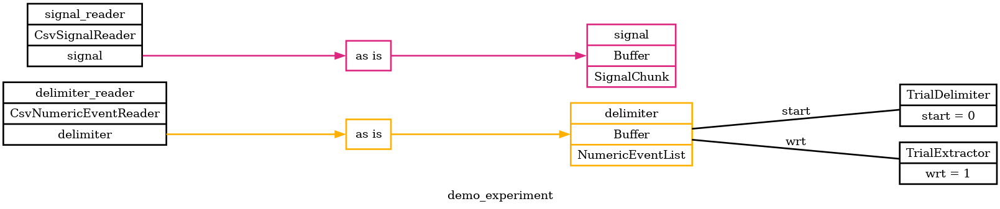
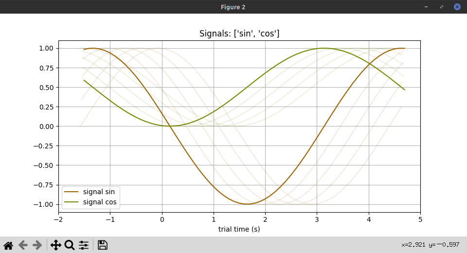
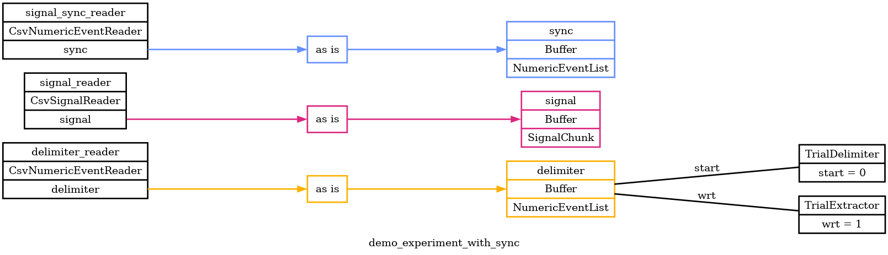
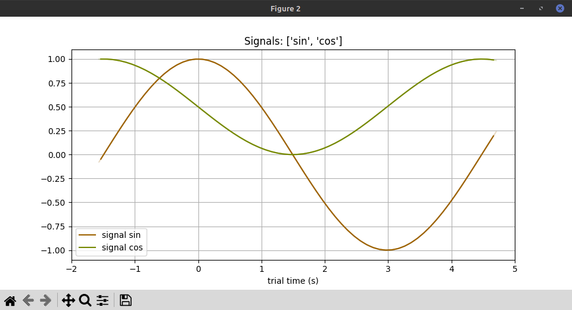

# Signals Demo

Here's a demo / example of Pyramid signal chunks, plotting, and alignment.

## overview

This demo has two parts.
The first part shows how to read sampled signals in chunks and plot them per trial.
This part will read from two CSV files:

 - [delimiter.csv](delimiter.csv), partitions about a minute of time into 10 trials.
 - [signal.csv](signal.csv) has many samples of the sin and cos functions over the same time range.

Pyramid will read in the delimiter events and signal data, partition them into trials, and plot signal chunks for each trial.

The second part of the demo imagines that the delimiter and signal CSVs were measured by different clocks.
It shows how Pyramid can estimate clock drift and apply a drift correction to each trial.
To do the drift estimation it adds a third file that partitions the demo time range into trials, from the perspective of the signal clock.

 - [signal_sync.csv](signal_sync.csv) contains .

## reading and plotting signals

Let's start with a graphical overview of the first part of the demo.

```
cd pyramid/docs/signal-demo

pyramid graph --graph-file demo_experiment.png --experiment demo_experiment.yaml
```

`demo_experiment.png`


This reflects much of the config set up in [demo_experiment.yaml](demo_experiment.yaml), which is the source of truth for this part of the demo.  Pyramid will read delimiting events from one `delimiter.csv` and signal data from `signal.csv`.  In practice the specific files to read from could be specified on the Pyramid command line with the `--readers` argument.  For this demo, it's easier just to put the file names in the YAML.

We can run this first part of the demo in `gui` mode to view the signals.

```
pyramid gui --trial-file demo_trials.json --experiment demo_experiment.yaml
```

This will open up two figure windows.  You might want to arrange them.
One figure will contain basic info about the experiment, demo subject, and trial extraction progress.
The other figure will show signal chunks assigned to each trial.



The trials will update every few seconds as trials occur, in this demo every 6.28 or `2pi` seconds.
Note that the sinusoidal signal appears to drif, trial after trial.
This is intentional, for demo purposes -- the sinusoids were computed with a period shorter than 1 trial, by a factor of 0.95.
This clock drift rate of 0.95 is pretty huge, exaggerated to make it pop out visually.

## estimating and correcting for clock drift

Pyramid has a way to esimate clock drift between readers and to apply a drift correction per trial.
Let's see it work, first, then look at how it works and how to set it up.

The second part of this demo uses a modified experiment YAML file, `demo_experiment_with_sync.yaml`.
The graphical overview shows that this adds a third CSV reader, which will read `signal_sync.csv`.

```
pyramid graph --graph-file demo_experiment_with_sync.png --experiment demo_experiment_with_sync.yaml
```

`demo_experiment_with_sync.png`


We can run this new experiment to see the same trial structure and sinusoidal signals, this time with clock drift correction to line up the signals on each trial.

```
pyramid gui --trial-file demo_trials_with_sync.json --experiment demo_experiment_with_sync.yaml
```



As before, trials will update every `2pi` seconds.
This time, the sinusoidal signal is fixed in place, relative to each trial.
Pyramid estimated a clock drift between the trial delimiter data and the signal samples, and applied a correction to each trial.
The correction is only a shift, and not a stretching or resampling of data.
As a result:
 - The sinusoids now coincide on each trial.
 - The peroid of the sinusoid is still less than `2pi` -- still wrong by the clock drift factor of 0.95.
 - Since the data are aligned to a point in the middle of each trial, the edges appear ragged from trial to trial.
 - The raggedness is quite visible in this example, since the drift factor is exaggerated.

With smaller, more realistic drift rates, the drift within a trial should be small, and the raggedness at the start and end of each trial should be small as well.

## configuring drift estimation

Pyramid drift estimation and correction is configured within the `readers:` section of experiment yaml, using a `sync:` section.
Here is the relevant configuration used in this example for each reader:

### delimiter_reader
```
readers:
  delimiter_reader:
    class: pyramid.neutral_zone.readers.csv.CsvNumericEventReader
    args:
      csv_file: delimiter.csv
      result_name: delimiter
    simulate_delay: True
    sync:
      # The delimiter_reader is the reference clock.
      is_reference: True
      reader_result_name: delimiter
      event_value: 1
```
The `delimiter_reader` reads trial-delimiting events from `delimiter.csv` into a Pyramid buffer named `delimiter`.
It looks for sync events with value `1` within this buffer and Pyramid stores these events as they arrive.
This reader is distinguised as the reference reader, to which other clocks will be compared and aligned.

### signal_reader
```
readers:
  # ...
  signal_reader:
    class: pyramid.neutral_zone.readers.csv.CsvSignalReader
    args:
      csv_file: signal.csv
      sample_frequency: 10
      result_name: signal
    sync:
      # The signal_reader gets synced to the signal_sync_reader.
      reader_name: signal_sync_reader
```
The `signal_reader` reads sampled sinusoidal signals from `signal.csv` into a Pyramid buffer named `signal`.
This reader itself doesn't read sync information, but instead it takes its sync from another reader, `signal_sync_reader`.
In general, each Pyramid reader can read and delcare its own sync configuration, or borrow sync from another reader by name.

### signal_sync_reader
```
readers:
  # ...
  signal_sync_reader:
    class: pyramid.neutral_zone.readers.csv.CsvNumericEventReader
    args:
      csv_file: signal_sync.csv
      result_name: sync
    sync:
      # The signal_sync_reader has independent measurements of sync events.
      reader_result_name: sync
      event_value: 1
```
The `signal_sync_reader` is new for the second part of this demo.
It reads trial-delimiting events from `signal_sync.csv` into a Pyramid buffer named `sync`.
It also looks for sync events with value `1` within its, and Pyramid stores these along with corresponding reference events.
This reader will be compared and aligned to the reference `delimiter_reader`, above.

The data for this reader in `signal_sync.csv` are similar to the data for `delimiter_reader` in `delimiter.csv`, above.
Both partition about a minute of time into 10 trials.
Whereas `delimiter.csv` contains reference times, `signal_sync.csv` contains times as if read by a separate clock, drifting at a rate of 0.95.
Pyramid treats these as independent measurements of the same "true" events, by different clocks.
It treats the differences between corresponding sync events as measurements of clock drift.
For each trial, it uses the most recent drift estimate, up to that point, to select and shift data from each reader to align with the reference.

## choosing corresponding sync events

Here's how Pyramid computes the drift estimate for each trial:
 - It compares each "other" reader, with its associated data buffers, to the reference reader.
 - It considers the latest sync event from the reference reader and finds the event from the other reader that's nearest in time (raw, uncorrected time).  This gives one candidate pair of events.
 - It considers the latest sync event from the other reader and finds the event from the reference reader that's nearest in time.  This gives another candidate pair of events (quite possibly the same as the first).
 - Between the two candidate pairs, it chooses the pair with the smallest difference in time.
 - For this pair, the time of the other reader minus the time of the reference reader is the clock drift.
 - It discounts the clock drift when quering buffers associated with the other reader for trial data.
 - It shifts data obtained from each buffer by the same clock drift.

This approach assumes that drift over all is small, less than half the duration of a trial.
This should allow some robustness in case readers record different numbers of sync events (starting at different times, or dropping events occasionally).

## misc. details and observations

This demo chooses the sinusoid peak as the clock drift "true" event in each trial.
It uses the same peak as the "wrt" time for each trial.
As a result, the aligned peaks always occur exactly at zero, on each trial.

Pyramid doesn't stretch or rescale data at all, it only shifts.
So trial duration is conserved, whether a reader has clock drift or not.
So, on a given trial, the data duration returned from each reader is the same.
Then when we shift the data to align on some event in the middle, we can't help but create ragged edges.
As long as drift is small compared to the duration of a trial, this raggedness should also be small.
This demo uses an exaggerated drift rate, so the raggedness is clearly visible.

This demo also uses a low sample rate, 10Hz, for the sinusoidal signal.
When selecting data for each trial, the signal buffers "round in" to a whole number of samples.
This results in signal chunks a fractional sample shorter than the nominal trial duration.
This exaggerates the signal raggedness at the edges, somewhat.
