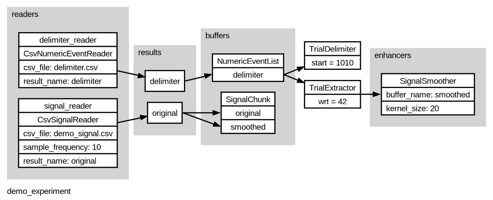
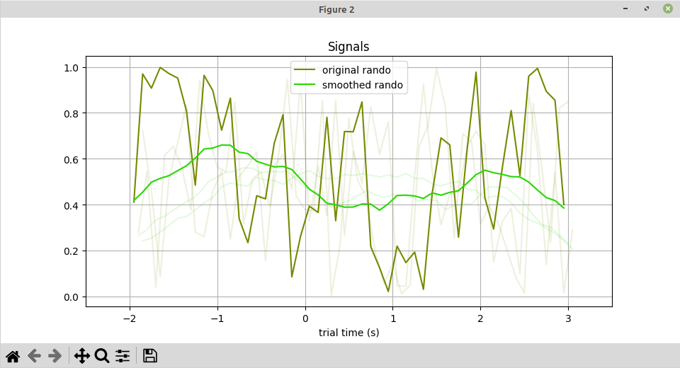

# Smooth Signals Demo

Here's a demo / example of Pyramid signal smoothing and normalizing, using a per-trial "adjuster" and an after-the-fact "collecter".

## overview

This example will read from two CSV files.
The first, [delimiter.csv](delimiter.csv), will partition about a minute of time into 10 trials.
The second, [demo_signal.csv](demo_signal.csv) contains a jagged signal of many random samples.

Pyramid will read in the delimiter events and signal data, partition them into trials, and plot signal chunks for each trial.
It will use a signal smoother to adjust the signal data for each trial in place, smoothing it out.
Both the original and smoothed data will be plotted for each trial.

## visualizing experiment configuration

Let's start with a graphical overview of this demo experiment.

```
cd pyramid/docs/smooth-demo

pyramid graph --graph-file demo_experiment.png --experiment demo_experiment.yaml
```

`demo_experiment.png`


This reflects much of the config set up in [demo_experiment.yaml](demo_experiment.yaml), which is the source of truth for this demo.  Pyramid will read delimiting events from one CSV file, and signal data from another CSV file.

## running with plotters

We can run this demo experiment in `gui` mode to view the signals.

```
pyramid gui --trial-file demo_trials.hdf5 --experiment demo_experiment.yaml
```

This will open up two figure windows.  You might want to arrange them.
One figure will contain basic info about the experiment, demo subject, and trial extraction progress.
The other figure will show signal chunks assigned to each trial.




The trials will update every few seconds as trials occur (in `gui` mode Pyramid can simulate delay while reading from data files.)

## Using a Pyramid collecter to normalize the signal amplitude

Someitme it may be useful to transform trial data after the fact, after seeing the whole session.  For example, we might want to normalize some signal data on each trial, based on the overall session data range.

Pyrmaid supports this kind of after-the-fact revision by way of "collecters".  These are like per-trial enhancers or adjusters with an extra `collect()` method.

Collecters work like this:

 - Each configured collecter gets a chance to `collect()` each trial, as trials are coming in normally.  This is a way to gather session-wide data or statistics, for example the overall range of some signal.

 - After the last trial, before Pyramid exits, Pyramid iterates through all the trials again.  Each configured collector gets a chance to `enhance()` each trial based on the collected data or statistics, for example to rescale the data based on the overall range.

[SignalNormalizer](https://github.com/benjamin-heasly/pyramid/blob/main/src/pyramid/trials/standard_collecters.py#L47) is a standard Pyramid collecter that implements signal rescaling by overall range, as described here.

Collecters can be added to an experiment in the same way as per-trial enhancers and adjusters, in the experiment YAML `trials:` section.

```
trials:
  # How to delimit Trials in time, and how to align data within each trial.
  start_buffer: delimiter
  start_value: 1010
  wrt_buffer: delimiter
  wrt_value: 42
  enhancers:
    - class: pyramid.trials.standard_adjusters.SignalSmoother
      args:
        buffer_name: smoothed
        kernel_size: 20
  collecters:
    - class: pyramid.trials.standard_collecters.SignalNormalizer
      args:
        buffer_name: smoothed
```

In fact, the `SignalNormalizer` configred here has already run as part of the `gui` command above.
As a result, the smoothed signal data written to the trial file `demo_trials.hdf5` have been normalized for their maximum absolute value.

Since the normalizing happeded after-the-fact, just before Pyramid exited, we didn't see the normalized version of the data in a Pyramid plotter.
We can look at the normalized data that's in the actual trial file using an HDF5 viewer, for example the [H5Web](https://marketplace.visualstudio.com/items?itemName=h5web.vscode-h5web) extension for Visual Studio Code.


The comparison is a bit awkward, but this image shows the same signal that appears in the Pyramid plotter image above.
In the original, it was a bright green line labeled "smoothed rando", with max value of about 6.5.
Here in the normalized version, the same signal has a max of about 0.9.
The normalized max value is not 1.0 because the normalization was based on the overall data range, not the per-trial data range.